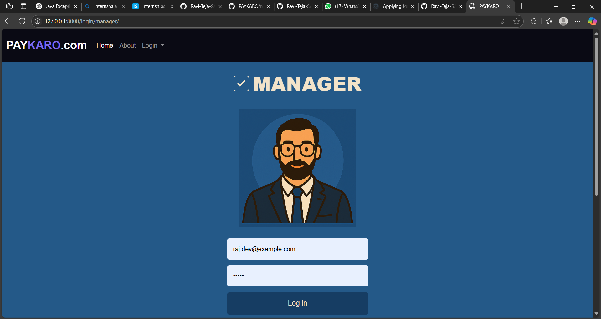

# PAYKARO - Payroll Management System

## Overview
PAYKARO is a web-based payroll management system built using **Python** and **Django**, with **MySQL** as the database backend. It helps businesses streamline salary calculations, employee records, and tax deductions efficiently.

## Features
- Employee registration and management
- Salary calculation and tax deductions
- Attendance tracking and leave management
- Automated payroll generation
- Secure authentication for employees and admins
- Export payroll reports in multiple formats

## Tech Stack
- **Frontend:** HTML, CSS, Bootstrap
- **Backend:** Python (Django Framework)
- **Database:** MySQL
- **Authentication:** Django Authentication System

## Frontend

## Installation
To set up the project locally, follow these steps:

1. Clone the repository:
   ```bash
   git clone https://github.com/Ravi-Teja-S/PAYKARO.git
